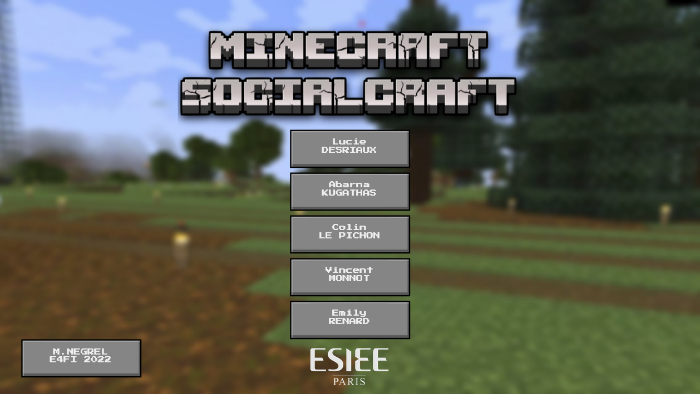
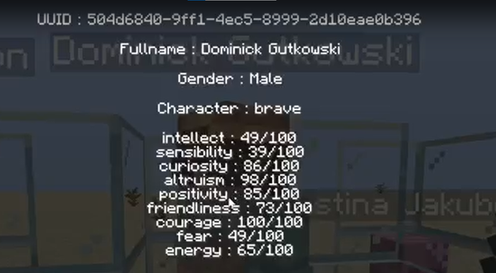
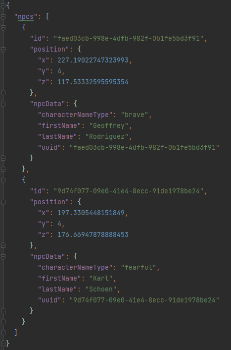
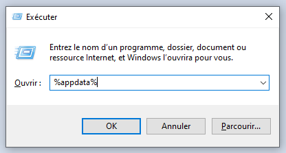
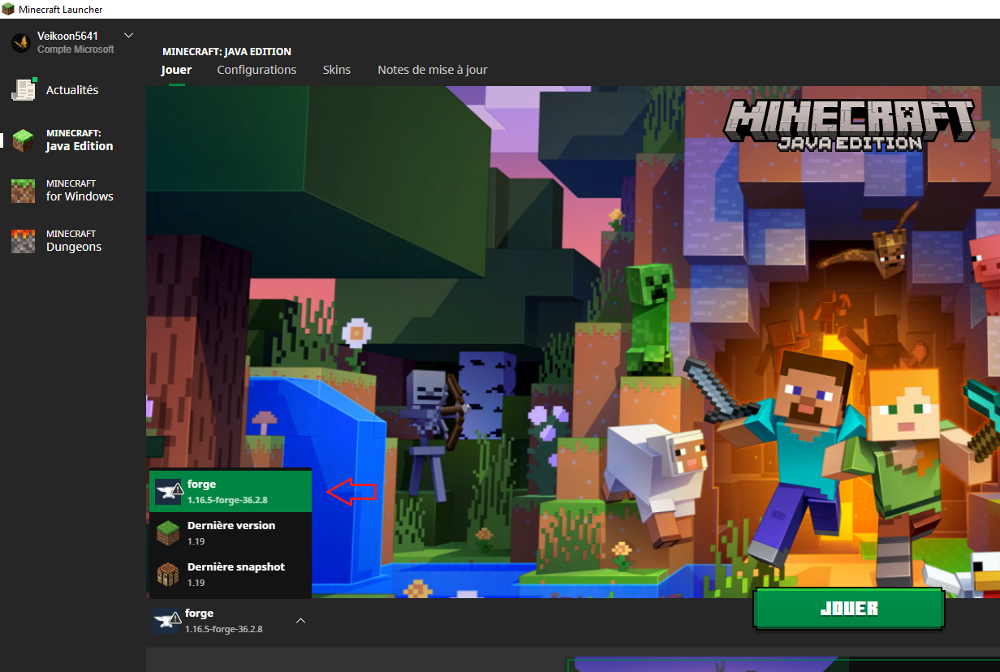

# SocialCraft



## Présentation du projet

Le mod Minecraft SocialCraft est le résultat d'un projet de recherche étudiant au sein de l'école ESIEE Paris.
Les objectifs de ce projet étaient de mettre en place des relations entre les personnages non joueurs au sein d'un jeu vidéo.
Ainsi des recherches ont étés menés dans les domaines suivants:

- Comportements instinctifs humains
- Activités quotidiennes
- Créations de relations inter personnages
- Evolution des capacités

Les technologies impliqués sont :

- Minecraft pour le jeu vidéo (v1.16.5)
- API Forge pour la création du mod (v36.2.8)
- JAVA pour le développement

## Contenu IN-GAME

Les caractéristiques suivantes ont été implémentés :

- BRAVE
- FEARFUL
- WISE
- DYNAMIC
- THOUGHTFUL
- DECEITFUL
- LEADER
- SELFISH
- LAZY

Il est possible d'invoquer manuellement un pnj avec un trait de caractère spécifique à l'aide de la commande suivante :

```
/npc spawn [personnalité]
```

Un menu affichant les statistiques d'un personnages non joueur est disponnible en visant la cible et en réalisant un clique droit :



Chaque jour révolu dans le jeu déclanche automatiquement une sauvegarde des personnages non joueurs crée par le mod afin de garder en mémoire l'état des entités et de leur relation dans le but de pouvoir retracer une évolution dans le long terme et de pouvoir les charger à nouveau dans le monde après avoir quitter le jeu.



## Installation du mod

Afin de pouvoir essayer notre projet vous devez au préalable posséder une version du jeu minecraft dans sa version JAVA.

https://launcher.mojang.com/download/MinecraftInstaller.exe

Une fois le jeu installer il faut télécharger la version Minecraft FORGE avec la version du jeu 1.16.5 (de préférence la version 36.2.8) disponnible ici  dans sa version client :

https://maven.minecraftforge.net/net/minecraftforge/forge/1.16.5-36.2.8/forge-1.16.5-36.2.8-installer.jar 

Le mod peut ensuite être déposé dans le dossier mods situé à la racine du jeu (pour y accéder appuyer sur WINDOWS+R et tapper "%appdata%") puis aller dans le dossier ".minecraft" :



Il est également possible de télécharger les installateurs nécessaires à l'installation dans le dossier docs.

Une fois installé il est possible de lancer le jeu dans sa version forge en selection la version correspondante :

